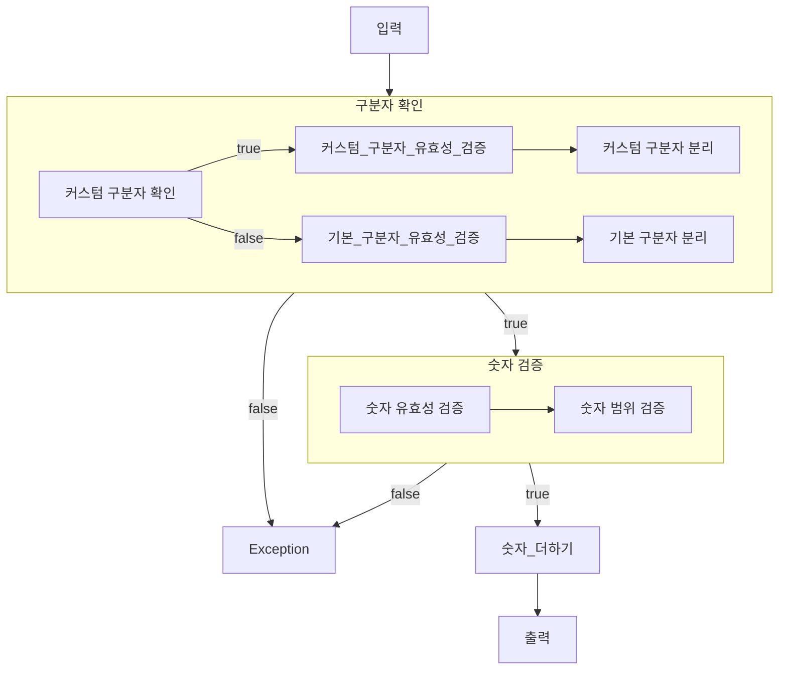

# java-calculator-precourse

# 커밋 컨벤션

```text
<type>(<scope>): <subject>
<BLANK LINE>
<body>
<BLANK LINE>
<footer>
```

# 계산기


## 기능
- 더하는 기능 밖에 없음
### 입력
- [x] 사용자로부터 입력 받기 
  - [x] static
  - [x] parameter
    - [x] message
### 검증
- [ ] 커스텀 구분자 확인
- [ ] 커스텀 구분자 유효성 검증
  - [ ] 커스텀 구분자가 아닌 값이 포함된 경우 예외 발생 
- [ ] 기본 구분자 유효성 검증
  - [ ] 기본 구분자가 아닌 값이 포함된 경우 예외 발생
- [ ] 숫자 검증
  - [ ] 숫자 범위 검증
    - [ ] 숫자 범위가 int 또는 long을 넘어가는 경우 예외 발생
### 분리
- [x] 구분자로 문자열 분리
### 변환
- [ ] 문자열을 정수타입으로 변환
### 더하기
- [ ] 숫자 더하기
  - [ ] 더할 때마다 숫자 범위를 넘어가지 않는지 확인

### 출력
- [ ] 출력